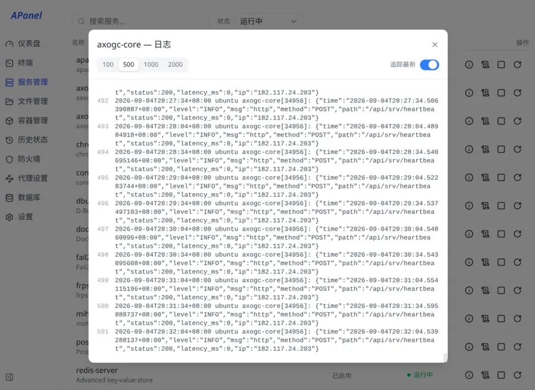
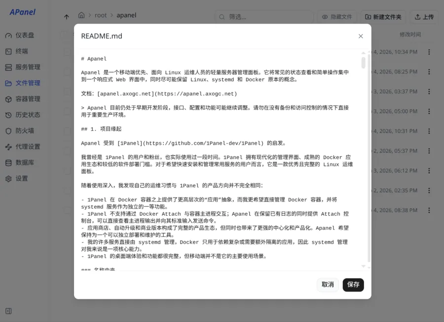
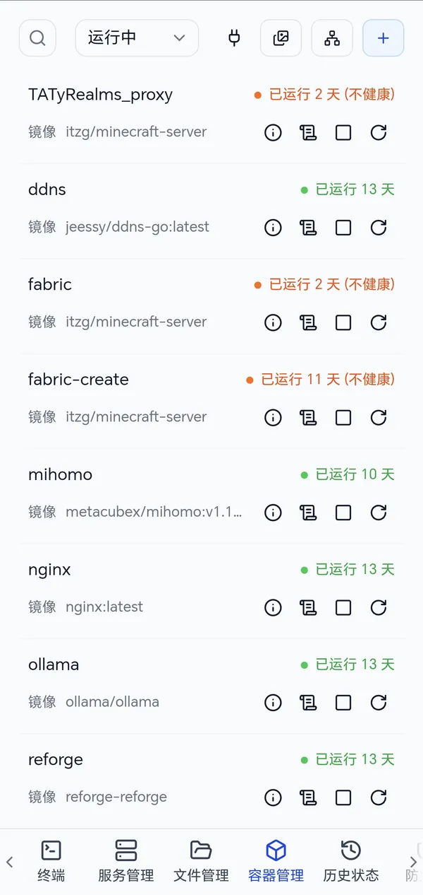
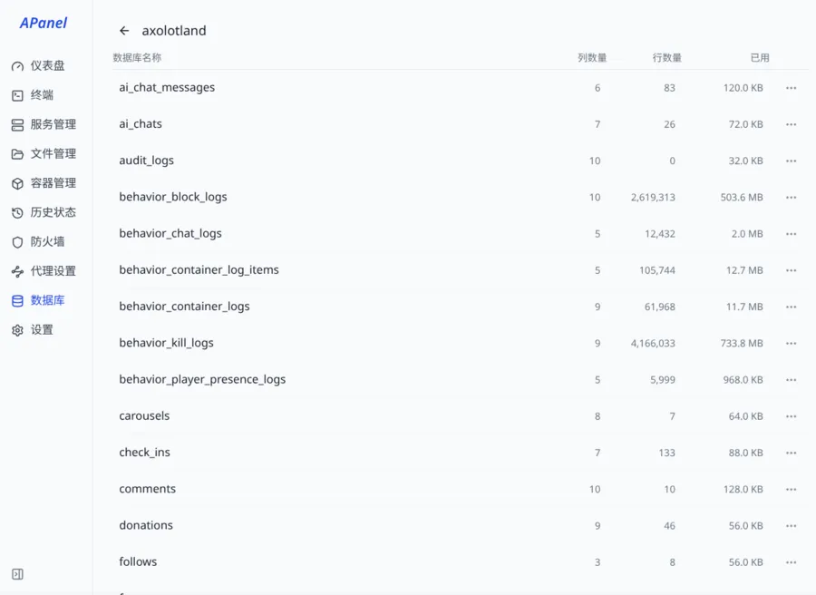
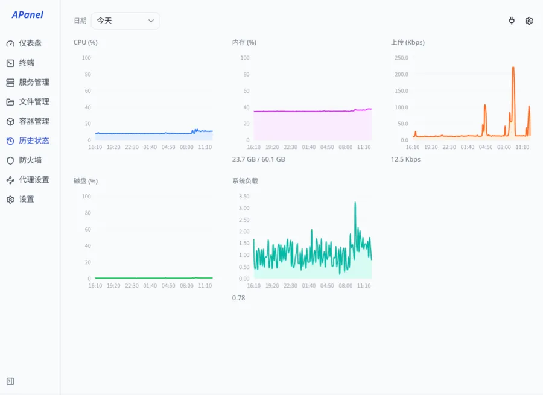
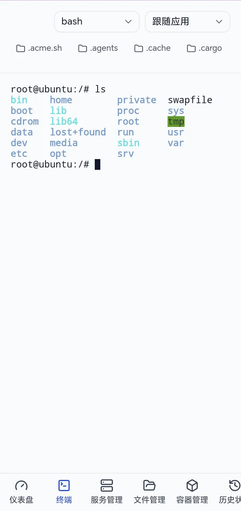
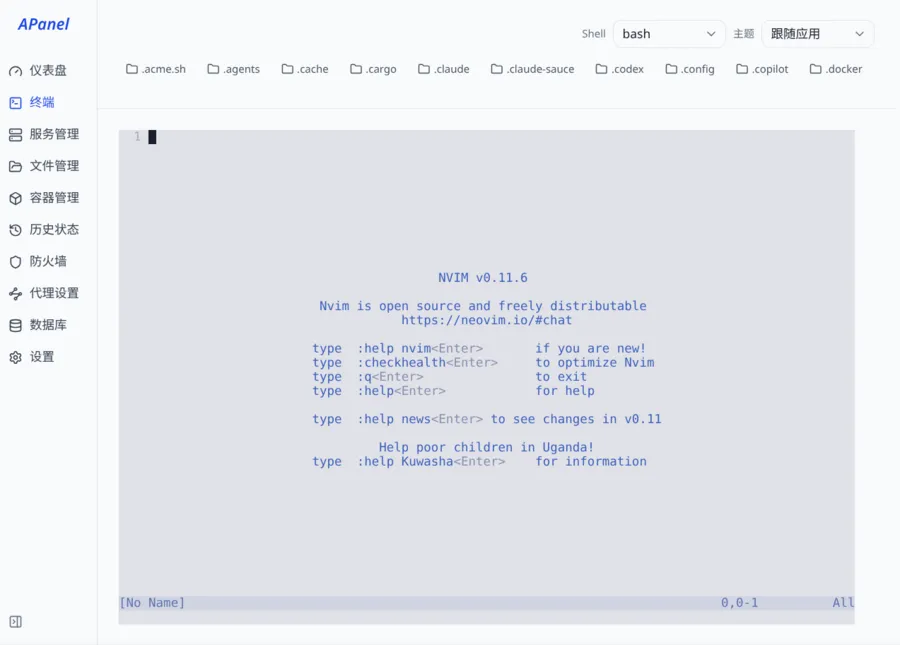

<h1 align="center">
  
  &nbsp;APanel —— 你的掌上Linux系统
</h1>

APanel 是一个移动端优先、Linux原生、轻量级的Web运维面板，使用Go + React开发，受到1Panel启发。

[文档：apanel.axogc.net](https://apanel.axogc.net)

> APanel 目前仍处于早期开发阶段，接口、配置和功能可能继续调整。

### 名称由来

`APanel`的命名借鉴 1Panel：`1` 是第一个数字，`A` 是第一个字母。

`A` 也代表作者创立的 [Axolotland Gaming Club（AxoGC）](https://www.axogc.net)，一个致力于开源软件、独立游戏、Minecraft服务器的非盈利圈子。

### APanel 特点

- **移动端优先**：优先为手机端做界面适配，方便不在电脑前时，快速查看服务状态，进行服务启停。
- **Linux原生**：暴露Linux基础概念，包括进程、systemd服务、Docker容器等，不做“应用”等高层抽象，适合有一定Linux经验的用户。
- **界面简洁**：界面风格扁平、朴素、低调、高效，以内容为主，而又不失美观。
- **轻量级**：单一二进制可执行程序，体积仅22MB，压缩后仅8MB。
- **非盈利**：软件完全开源免费，不提供商业化付费版本，使用GPL许可证。不提供官方应用商城。

### 为什么移动端优先？

- 如果电脑就在身边，完全可以用SSH和键盘进行更高效、更灵活的运维，没有理由去用Web面板。
- APanel的存在，就是为了解决：运维人不在电脑前，希望通过手机查看服务器占用、服务状态、执行启动/停止/重启等简单操作的场景。
- Termux/Termius等工具当然也能用，但在手机上输命令不是很方便。

### 1. 和1Panel的关系

APanel 受到 [1Panel](https://github.com/1Panel-dev/1Panel) 的启发。我曾经是 1Panel 的粉丝。1Panel 拥有现代化的界面、成熟的 Docker 生态和较低的门槛，是一款优秀的 Linux 面板。随着深入使用，我的需求与 1Panel 并不完全相同：

- 1Panel很多数据用表格展示，手机端适配差，用手机管理服务不是很方便；
- 1Panel不支持Docker Attach，无法交互式地向Minecraft服务器发送命令；
- 我的一部分服务由 systemd 管理，一部分 Docker 管理，1Panel不支持systemd；

## 2. 功能模块一览

### 仪表盘

- 仪表盘展示CPU、内存、带宽占用；进程管理，支持父子进程树、按CPU/内存排序、进程详情。

<p align="center">
  
  
</p>

### 设置

- 包括主机信息栏、支持亮色/暗色、主题色切换、中文/English切换、面板模块（容器/数据库）启用/禁用。

<p align="center">
  
  
</p>

### systemd 服务管理

- 基于systemd，包括服务列表、服务详情和日志、暂停和重启服务。

<p align="center">
  
  
</p>

### 文件管理

- 创建目录、上传/下载/删除、多选和批量操作、文本文件预览和编辑、图片预览。

<p align="center">
  
  
</p>

### Docker 容器管理

- 容器详情和日志、关闭/重启/创建容器、docker exec/attach、镜像管理、网络管理、数据卷管理。

<p align="center">
  
  
</p>

### 数据库管理

- 支持`MySQL`/`PostgreSQL`，统计显示数据库列表、表列表、磁盘占用、字段数、总数据行数。

<p align="center">
  
  
</p>

### 历史状态

- 基于`sysstat`，支持CPU、内存、硬盘I/O、上行速率、负载的存储和统计，支持查看历史数据。

<p align="center">
  
  
</p>

### 防火墙管理

- 基于`UFW`，支持添加/编辑/删除规则，支持设置允许/拒绝、TCP/UDP、IPv4/IPv6、来源地址。

<p align="center">
  
  
</p>

### 代理设置

- 基于`clash`/`mihomo`，支持修改全局/规则/直连、按规则设置代理、代理测速。

<p align="center">
  
  
</p>

### 日志审计

- 存储面板的历史操作记录，便于追溯。包括操作用户、源IP、操作时间等，默认保留7天。

<p align="center">
  
  
</p>

### Web 终端

- 支持`sh`/`bash`/`zsh`/`fish`，连接状态持久化，切换页面后连接不断开。

<p align="center">
  
  
</p>

## 3. 安装

### 3.1 系统要求

- APanel需要一个使用systemd的Linux系统，例如Ubuntu/Debian/CentOS/Arch Linux等，不支持使用OpenRC的Alpine Linux等。

### 3.2 一键安装脚本

```bash
curl -fsSL https://raw.githubusercontent.com/axogc/apanel/main/install.sh | sudo bash
```

如果你的服务器网络无法访问GitHub，可以尝试下面的命令：

```bash
curl -fsSL https://apanel.axogc.net/install.sh | sudo bash
```
这个脚本将会：

- 下载最新版APanel，并解压到`/usr/local/bin/apanel`（如果有旧版，将替换）；
- 创建最小化`/etc/systemd/system/apanel.service`文件（如果有旧版，就保留）；
- 启动APanel服务；

如果你想手动逐步安装，不想用一键脚本，请参阅[apanel.axogc.net/install.html](https://apanel.axogc.net/install.html)

如果你想自己编译程序，请参阅[apanel.axogc.net/build.html](https://apanel.axogc.net/build.html)

### 3.3 启用 HTTPS：二选一

APanel强烈建议启用HTTPS，以保护你的服务器的密码等隐私，可以直接APanel配置证书，也可以用已经配置证书的Nginx对APanel反向代理。详见[安全使用](https://apanel.axogc.net/secure.html)。

#### 方式 A：由 APanel 直接终止 TLS

编辑`/etc/systemd/system/apanel.service`，在`[Service]`部分声明证书、私钥：

```ini
[Service]
ExecStart=/usr/local/bin/apanel
Environment=APANEL_TLS_CERT=/path/to/fullchain.pem
Environment=APANEL_TLS_KEY=/path/to/privkey.pem
Restart=on-failure
```

重新加载并重启服务：

```bash
sudo systemctl daemon-reload
sudo systemctl restart apanel
```

#### 方式 B：由 Nginx 终止 TLS 并反向代理

站点配置示例：

```nginx
server {
  listen 443 ssl;
  server_name panel.example.com;

  ssl_certificate     /path/to/fullchain.pem;
  ssl_certificate_key /path/to/private.key;
  location / {
    proxy_pass http://127.0.0.1:8123;
    proxy_http_version 1.1;
    proxy_set_header Upgrade           $http_upgrade;
    proxy_set_header Connection        $connection_upgrade;
    proxy_set_header Host              $host;
    proxy_set_header X-Real-IP         $remote_addr;
    proxy_set_header X-Forwarded-For   $proxy_add_x_forwarded_for;
    proxy_set_header X-Forwarded-Proto $scheme;
    proxy_read_timeout 1h;
    proxy_send_timeout 1h;
    proxy_buffering off;
  }
}
```

### 3.4 升级

升级只替换可执行文件，数据库和 systemd 单元都不受影响，具体请参阅[apanel.axogc.net/upgrade.html](https://apanel.axogc.net/upgrade.html)。

### 3.5 忘记密码

忘记登录密码时，可以直接删除`/var/lib/apanel/apanel.db`数据库，也可以只重置密码、保留其余设置，具体步骤请参阅[apanel.axogc.net/install.html](https://apanel.axogc.net/install.html)的「5. 忘记密码」一节。

## 4. 许可证

APanel 使用 [GPLv3](./LICENSE) 许可证开源。
